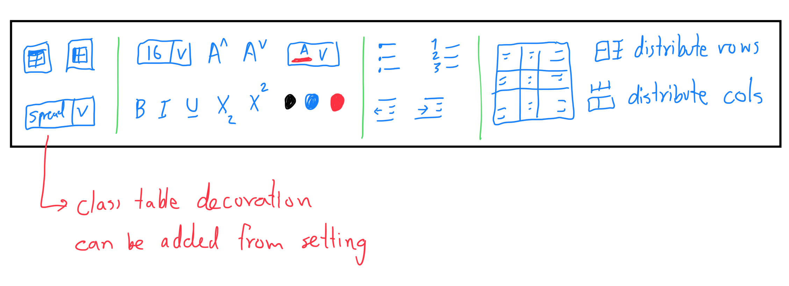

# Easy table plugin

## Feature

Implemented

- [x] add th
- [x] table orientation (side / top)
- [x] able to merge with merged cell
- [x] table class for decoration (spread)
- [x] edit in custom tab
- [x] someway to resize the table
- [x] change dropdown to type input
- [x] cell alignment
- [x] insert image by paste
- [x] make convertMDTable competible with different attachment location

In process

- [ ] font color
- [ ] font size
- [ ] clean up toolbar
- [ ] undo/reundo

## Bug fix

Implemented

- [x] fix delete row / col
- [x] fix add row / col with th

In process

- [ ] fix convert MD table
  - [x] image
  - [x] image not show in UI
  - [ ] previous table class
- [ ] link resize btn and input

